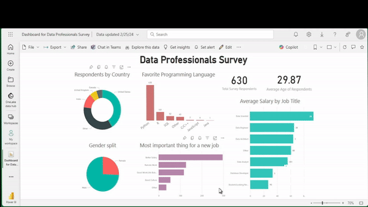
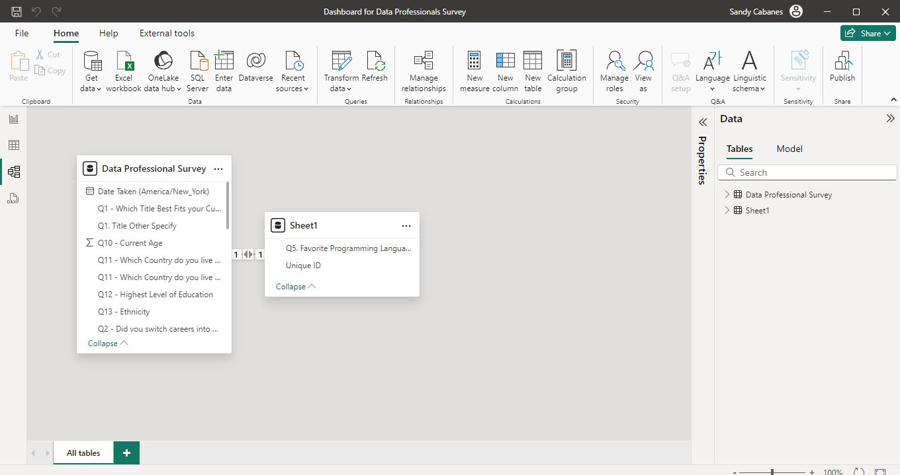

# PowerBI_Dashboard_Data_Professionals_Survey

As with all dashboards, my dashboard is also interactive.  You can click on any color in the Gender chart for a Gender sub-group, or in the Country chart for a country sub-group.

## Key Insights:  Average age of the sample is 29, with about 3/4 male and 1/4 female.  Favorite language is python.  
## The highest average salary belongs to Data Scientist followed by Data Engineer.  This sample's most important thing for a job is "high salary."   About less than half of respondents are from the U.S.

###   
### Feel free to look at the mp4 video file to see a higher resolution version.  (Dashboard for Data Professionals Survey.mp4)

#### Workflow Documentation:  Dataset Imported using PowerQuery and Transformations Done as follows.
-- Removed non-useful columns

-- Others: Specify truncated to Others by Split Column option, Custom delimiter = (  
-- Second column after delimiter is deleted  
-- Applied to columns: Titles, Industry work in, Favorite program, Country Live In  

-- Salary ranges: Split Column by delimiter, two new columns created as lower and upper salary  
-- Character 'k' removed using Replace Values  
-- New lower and upper range columns formatted as Whole Number  
-- Highest bin 225+ will have both lower and upper range as 225 for the average  
-- Custom Column Salary Average using (New Lower salary and New Upper salary) / 2  

#### Added steps:   
-- Extracted unique ID column and the Favorite Programming Language as a separate xlsx file named Favorite Programming Language Merged.xlsx.  
-- Replaced "Other: Specify" as SQL if string contains SQL.   
-- Joined this new xlsx file to the current table using the unique ID column.  

##### Link to the dataset here -> https://github.com/AlexTheAnalyst/Power-BI/blob/main/Power%20BI%20-%20Final%20Project.xlsx

##### Huge thanks to [@AlexTheAnalyst](https://www.youtube.com/watch?v=g0m5sEHPU-s) and his youtube channel for guiding this project.
